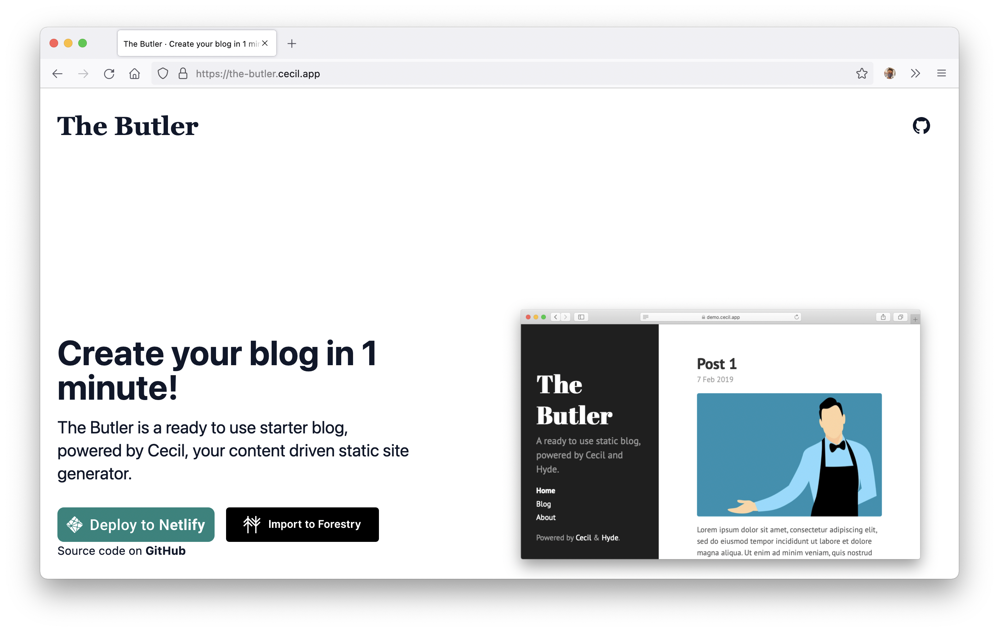

# App Landing theme

_App Landing_ is a theme for [Cecil](https://cecil.app), powered by [Tailwind CSS](https://tailwindcss.com).



## Installation

```bash
composer require cecil/theme-applanding
```

> Or [download the latest archive](https://github.com/Cecilapp/theme-applanding/releases/latest/) and uncompress its content in `themes/applanding`.

## Usage

### Configure Cecil

Add `applanding` in the `theme` section of your `config.yml`:

```yaml
theme:
  - applanding
```

**Example:**

```yaml
theme:
  - applanding
applanding:
  buttons:
    - name: Netlify
      url: https://cecil.app/hosting/netlify/deploy
      image: https://www.netlify.com/img/deploy/button.svg
  source: https://github.com/Cecilapp/the-butler
  documentation: https://github.com/Cecilapp/the-butler#readme
  demo: https://the-butler-demo.cecil.app
  screenshot: cecil-preview.png
```

### Build the CSS

Run the following command to build the CSS file:

```bash
npm run css:build
```

## License

 _App Landing_ is a free software distributed under the terms of the MIT license.

© [Arnaud Ligny](https://arnaudligny.fr)
